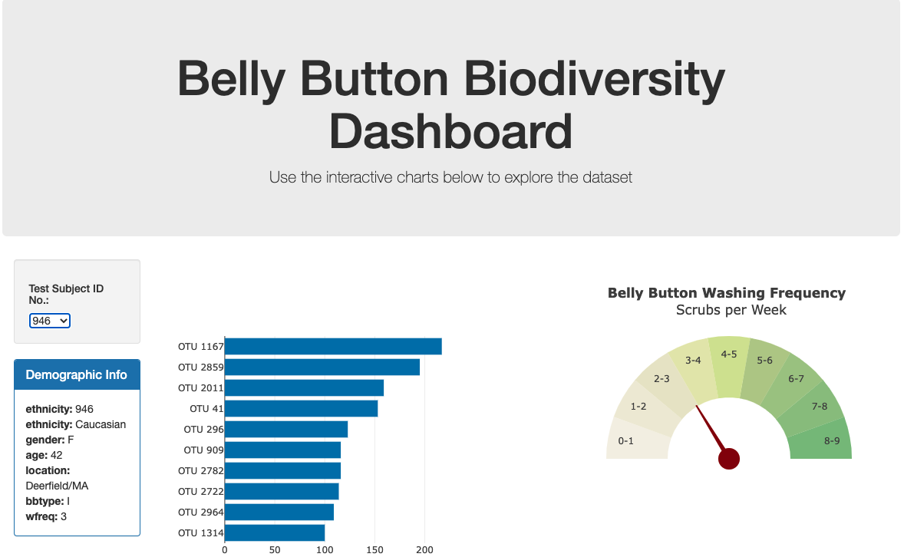

# Belly Button Biodiversity: An Interactive Web Visualization

Homework for Boot Camp Week 14: JavaScript and Plotly; Submitted by Corey Lawson-Enos

## Summary
* Web application that calls sample data of microbial species found in test subjects' navels via API.
* Charts individual subject's demographics and their unique microbial concentrations--operational taxonomic units, or OTUs.
* Includes a washing frequency indicator for immediate, visual comparison with charted OTU concentration levels.

## Technologies
HTML, JavaScript, Plotly.

## Web Application Address

* 

## Landing Preview

## Source

* Hulcr, J. et al. (2012) A Jungle in There: Bacteria in Belly Buttons are Highly Diverse, but Predictable. 
* Retrieved from: http://robdunnlab.com/projects/belly-button-biodiversity/results-and-data/
* JSON Link: https://2u-data-curriculum-team.s3.amazonaws.com/dataviz-classroom/v1.1/14-Interactive-Web-Visualizations/02-Homework/samples.json
